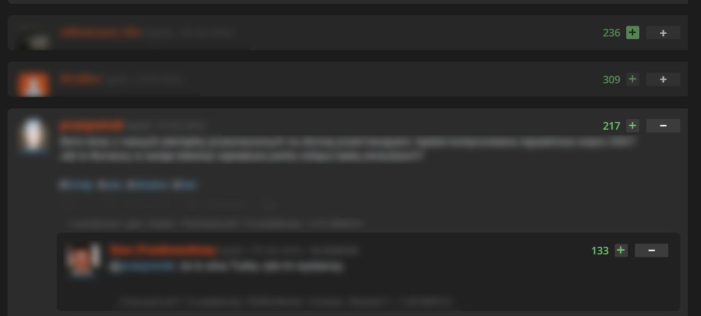

# Krawężnik aka Wykop Entry Collapser

Skrypt do rozszerzenia Tampermonkey, który dodaje możliwość zwijania i rozwijania wpisów na portalu Wykop.pl. 
Skrypt wręcz **Must Have** dla ludzi którzy śledzą gorące, a dzięki któremu łatwo ukryjesz przeczytane już wpisy i zrobisz porządek na mikroblogu.

## Główne funkcje:
* **Zwijanie wpisów:** Dodaje dyskretny przycisk (`−` / `+`) obok ocen wpisu (działa na mikroblogu jak i stronie głównej).
* **Pamięć sesji:** Skrypt zapamiętuje, które wpisy zostały zwinięte. Po odświeżeniu strony przeczytane wpisy nadal będą ukryte.
* **Auto-czyszczenie:** Aby nie zaśmiecać pamięci przeglądarki, zwinięte wpisy są automatycznie usuwane z pamięci po 3 dniach.

## Rekomendowany wygląd:
Skrypt został stworzony do współpracy ze zmienionym interfejsem. Osobiście używam go w połączeniu z rozszerzeniem **Stylus** oraz stylem:
 **[Wykop X / The Best Style](https://github.com/tentin-quarantino/wykop-the-best-style)**  
Bardzo polecam, ponieważ przywraca on stary dobry wygląd wykopu.

> Skrypt bez dodatkowego wyglądu również działa, lecz znak "-" do zwijania nie ma ramki wokół siebie.

## Instalacja:

1. Zainstaluj darmowe rozszerzenie **Tampermonkey** dla swojej przeglądarki: ([Chrome](https://chrome.google.com/webstore/detail/tampermonkey/dhdgffkkebhmkfjojejmpbldmpobfkfo) / [Firefox](https://addons.mozilla.org/pl/firefox/addon/tampermonkey/) / [Edge](https://microsoftedge.microsoft.com/addons/detail/tampermonkey/iikmkjmpaadaobahmlepeloendndfphd)).
2. Kliknij w poniższy link, aby zainstalować skrypt:

**[ZAINSTALUJ SKRYPT](https://github.com/Black-Reven/Kraweznik-Wykop-Entry-Collapser/raw/main/Kraweznik.user.js)**

**[ZAINSTALUJ PRZEZ GREASY FORK](https://greasyfork.org/pl/scripts/571424-kraw%C4%99%C5%BCnik-wykop-entry-collapser)** 

## WAŻNE!!!
Chciałbym zaznaczyć, że **nie jestem programistą**, a samo programowanie to dla mnie czarna magia.   
Skrypt powstał z potrzeby oraz wizji, którą udało się przekształcić w działający kod przy wsparciu różnych AI.

Zależy mi na tym, aby to narzędzie było jak najlepsze dla wszystkich użytkowników Wykopu. Jeśli zauważysz w kodzie błędy, braki lub masz pomysł na optymalizację to **bardzo proszę o ich wypunktowanie**. Będę wdzięczny za każdą pomoc, a jeszcze bardziej za gotowe edycje kodu wraz z poprawkami!

---
> ### Ciekawostka:
> Nazwa **"Krawężnik"** pochodzi z oryginalnego skryptu kiedy to na Wykop.pl można było jeszcze bezpośrednio instalować dodatki. Sam skrypt był na szczycie popularności, lecz było to z dobre 13 lat temu.
